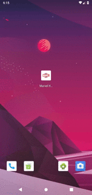
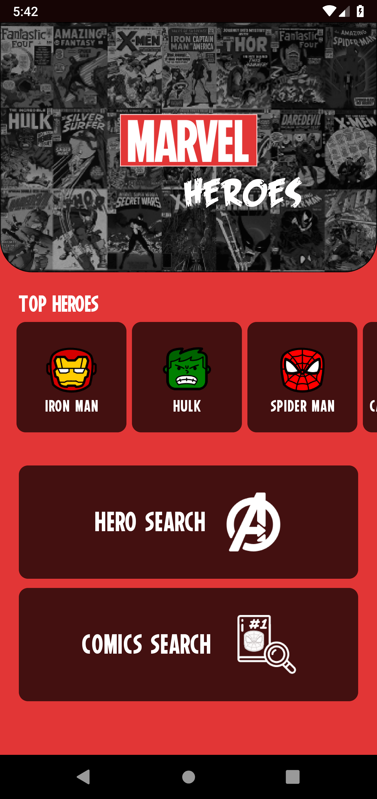
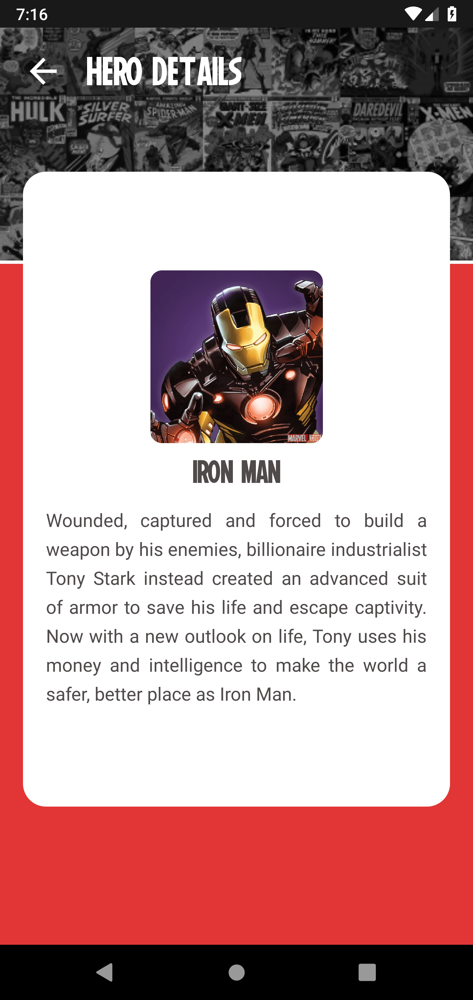
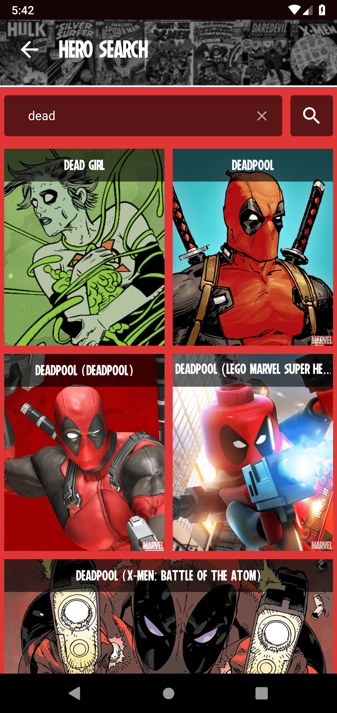
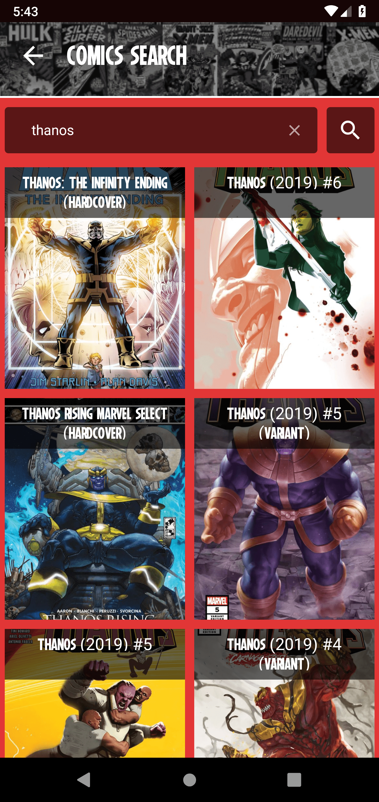
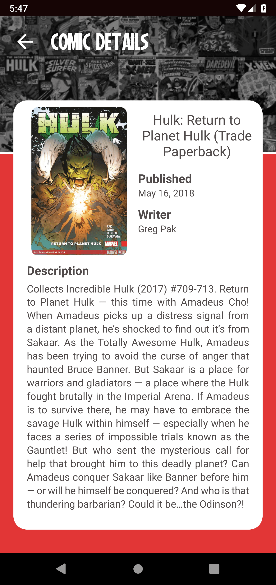
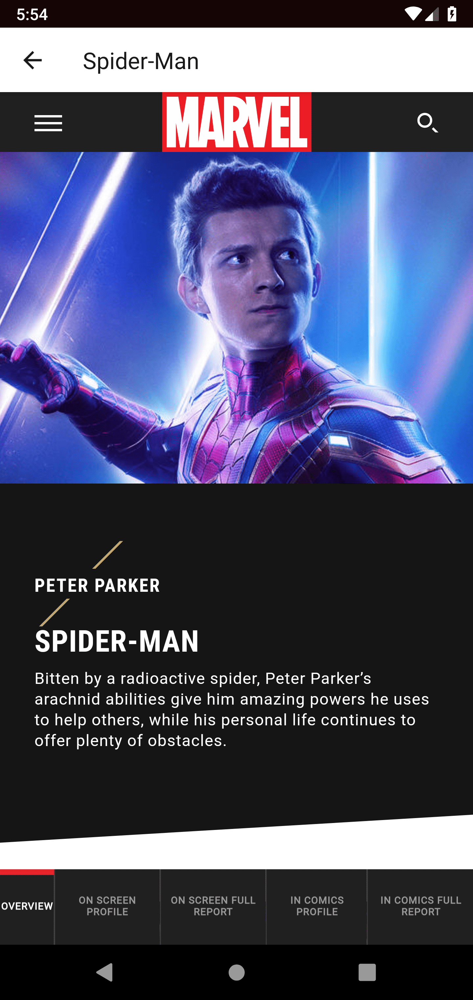

<h1 align="center">
  
</h1>

<h2 align="center">
  Marvel Heroes App
</h2>

  

## :iphone: About

This is a personal project built for learning purposes. It uses the official Marvel API

# functionalities

## Built with

- React Native
- ES6
- Reactotron
- Styled Components
- Lottie Animations

## :framed_picture: Application Screens

<h1 align="center">

</h1>

# Author

- [**Matheus Aguiar**](https://www.linkedin.com/in/mfzaguiar/)
